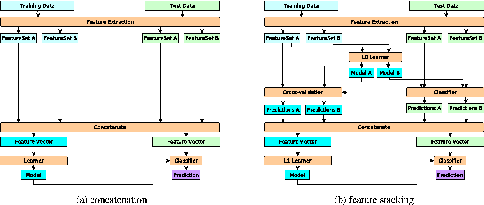
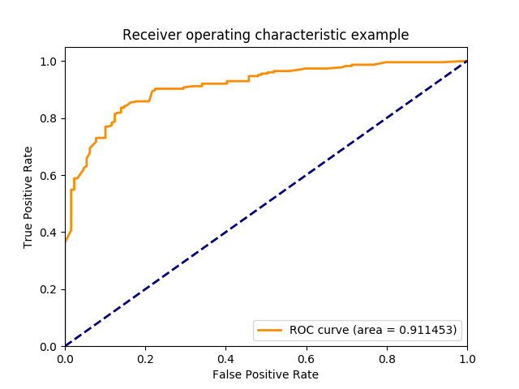

# Introduction

This repository contains the source code, results, and reports produced as part of a project aimed at analyzing on-line book discussions by elementary school-aged children. The discussions were obtained during studies performed to test the effectiveness of using the IMapBook software suite in 4th-grade classrooms.

We constructed a system for predicting whether messages posted during the discussion were relevant to the discussed books, whether the message is a statement, question or an answer, and also to which of the specified categories the message can be assigned.

We first present the implementation details of the system and describe how the message features are obtained and how the classifications are made. We describe the classifiers used, namely, the so-called feature stacking classifier and the classifier combining a standard model with predictions made using computed conditional probabilities and a Markov model.

# Implementation Details

The implementation part of the repository is organized into three main directories. The *src* folder contains all the code developed for this project. The *data* folder contains the data in the
form of the original discussions, lists of given names, names found in stories, and curse words. The *results* folder contains all the results obtained during the evaluation. The file *results.txt*
contains various computed classification metrics obtained during the evaluations. The files *fn.xlsx*, *fp.xlsx*, *tn.xlsx*, and *tp.xlsx* produced after classification contain messages representing false negatives, false positives, true negatives, and true positives respectively. The *results/plots* subfolder contains all plots produced during evaluation.

## Obtaining the Data

The messages and their relevant corresponding labels are parsed from the *data/discussions.xlsx* file. We also implemented parsing of a set of Slovene curse words and given names
from specified websites. The parsed curse words and names are stored in the curse\_words.txt and names.txt files respectively. The chat nicknames used in the discussions are also
parsed and stored in the *chat\_names.txt* file. The *story\_names.txt* file contains names and keywords found in stories being discussed. These can be entered manually or parsed from
the provided files.

We also implemented a simple translation utility in the form of a dictionary mapping non-standard Slovene words to their standard counterparts. The mappings were obtained
from the JANOS project data repository. The dictionary is contained in the *slo\_nstd\_dict.p* file and can be loaded using Python's pickle module. The file *clue\_words.txt* contains
some words deemed to be important for successful classification using domain knowledge.


## Processing the Data and Obtaining Features

For the successful application of predictive machine learning algorithms, discriminative features must be extracted from the messages forming the discussion.
We start by computing some general features such as the number of words in the message, the maximum, minimum and average word length, the number of digits
found in the message, the number of punctuation marks, the number of capital letters in the message, whether the message starts with a capital and whether it ends with
a punctuation mark. We then remove the punctuation from the message and count the number of known curse words, given names, chat names, and names in stories found in
the message. Each count represents a separate feature. We then perform a simple POS tagging to messages that are first translated from non-standard to standard Slovene
using a dictionary built from data obtained from the JANOS project repository. We compute the tf-idf statistic for each tag and build a feature vector. We also compute
bag-of-words features using unigrams and bigrams. The features are joined into a single vector representing the message. We also record the lengths of the feature subsets
for use with the feature stacking ensemble classifier.

The usage of the non-standard to standard Slovene dictionary is demonstrated below.

```python
>>> import pickle
>>> from feature_engineering import translate_nstd

>>> with open('../data/slo_nstd_dict.p', 'rb') as f:
...    slo_nstd_dict = pickle.load(f)
>>> message = 'joj matr sm skor puzabu da maš dons rojstn dan''
>>> translate_nstd(message, slo_nstd_dict)
'joj mater sem skoraj pozabil da imaš danes rojstni dan'
```

The processed messages are stored in the *data/cached/* directory and are retrieved as needed.

## The Feature Stacking Classifier

We use several classification algorithms to make predictions. A notable algorithm is the so-called Feature stacking
approach which combines several classifiers each trained on a feature subset and a final classifier that takes as its input
the output of these classifiers. The authors of the paper [[1]](#1) describing the Feature stacking approach suggest using logistic regression
as the feature classification method since it makes the method resemble a neural network structure. We use an SVM as the final classifier.

During training, the training data is converted to new features consisting of logistic regression outputs for each feature subset. This is achieved
using k-fold cross-validation. Next, logistic regression is fitted to the entire training data feature subsets and is used to encode the test data.
A final meta-classifier is fitted to the training data encoded using logistic regression. Test data is first encoded using a trained logistic
regression model and finally classified with the meta-classifier. The feature stacking method is implemented in the *feat\_stacking\_clf.py* file.
The features stacking method is contrasted with the more typical feature concatenation method on the diagram below taken from [[1]](#1).



## Combining Classifiers with a Markov Model and Conditional Probabilities

Most of the features describing messages do not capture the temporal dependencies of the messages which are often crucial to correct classification. 
Messages of a certain type usually occur in clusters. A great deal of information can, therefore, be lost by considering the messages as independent units. 
We attempted to capture these temporal dependencies by constructing a Markov model using the training data. We also computed the conditional probabilities of 
classes using the previous n classifications. We combined the predictions made by the Markov model and the conditional probabilities with other machine learning 
classifiers by implementing a wrapper in the *clf\_wrap.py* file. This wrapper class weights the prediction made by all three models using specified weights.

# Usage Instructions

To use this system, we must first parse the necessary data from the file containing the raw discussions as well as
auxiliary data, such as the list of curse words and given names, from the web. This can be done by running the *parse.py* script
in the *src* directory with the **--parse** command-line argument.

After running the *parse.py* script with the **--parse** command-line argument and inspecting the obtained curse words in the *curse\_words.txt* list as well as
the obtained given names in the *names.txt* files, run the same script *parse.py* again but this time with the ***--initialize*** command-line argument. This will
build a dictionary aggregating all the data obtained in the previous step. The dictionary is saved using Python's pickle module in the *data/data-processed/* folder.

We are now ready to run the *feature\_engineering.py* script to perform feature engineering/extraction on the messages. Simply run the *feature\_engineering.py* script and
wait for the feature extraction process to end.

We are now finally ready to run the evaluations. Simply run the *evaluate.py* script with command-line arguments specifying the classification method to evaluate, the action
to perform and the evaluation method to use.

The command-line option ***--method*** is used to select the classification model to evaluate. Valid arguments are ***rf*** for the random-forest model, ***SVM*** for the support vector machine model, and ***stacking*** for the feature stacking method. The action to perform is specified using the ***--action*** option. The argument ***eval*** is used to evaluate the model using
either a train-test split or cross-validation. This is specified using the ***--eval-method*** option with possible arguments ***tts*** (train-test split) and ***cv*** (cross-validation). The
argument ***roc*** for the ***--action*** option instructs the program to compute and plot the ROS curve as vel as the AUC value for a train-test split. The plot is saved in the *results/plots/*
directory. The cm argument is used to construct a confusion matrix using a train-test split. Again, the plot is saved in the *results/plots/* directory. The ***repl*** argument is used
to run a repl for real-time evaluation of user-provided messages.

## The REPL

As stated earlier the REPL can be accessed by running the *evaluate.py* script with the ***--action repl*** command-line option argument pair. Additionally, the classification model can be
specified using the ***--method*** option as described in the previous section. The REPL allows the evaluation of user-provided messages. It stores previous classification results to allow
the use of the Markov model and the conditional probabilities computed on training data. The REPL loop can be terminated by simply typing quit. The REPL processes each
message and outputs the probabilities resulting from running the classification algorithm. An example of a REPL session is shown below. The probabilities below messages indicate predicted
probabilities of messages being relevant to discussed books or not.


# Preliminary Results

We started by trying to predict the relevance of messages to the actual books being discussed. We used a train-test split as well as 10-fold cross validation 
to evaluate the predictions of our models. The table below shows the obtained results for the random-forest, SVM and feature stacking models as well as for baseline
majority and uniformly random classifiers.

| model               | accuracy (tts) | accuracy (cv) | precission            | recall                | f1-score              | support             |
|---------------------|----------------|---------------|-----------------------|-----------------------|-----------------------|---------------------|
| rf                  | 0.8281         | 0.8347        | 0.76 (no), 0.87 (yes) | 0.78 (no), 0.86 (yes) | 0.77 (no), 0.86 (yes) | 226 (no), 129 (yes) |
| svm                 | 0.8169         | 0.8362        | 0.73 (no), 0.85 (yes) | 0.74 (no), 0.84 (yes) | 0.73 (no), 0.84 (yes) | 226 (no), 129 (yes) |
| stacking            | 0.8479         | 0.8296        | 0.82 (no), 0.86 (yes) | 0.75 (no), 0.90 (yes) | 0.78 (no), 0.88 (yes) | 226 (no), 129 (yes) |
| baseline (majority) | 0.3634         | 0.6085        | 0.36 (no), 0.00 (yes) | 1.00 (no), 0.00 (yes) | 0.53 (no), 0.00 (yes) | 226 (no), 129 (yes) |
| baseline (uniform)  | 0.4873         | 0.4993        | 0.34 (no), 0.61 (yes) | 0.48 (no), 0.64 (yes) | 0.40 (no), 0.53 (yes) | 226 (no), 129 (yes) |

The figure below shows the confusion matrix obtained using the Feature stacking method evaluated using a train-test split. The false negatives
and positives can be found in the *results* folder in the *fn.xlsx* and *fp.xlsx* files respectively. We can see that short messages, the relevance of
which is extremely ambiguous when taken out of context, make up the majority of the false negatives.


The figure below shows the ROC curve obtained using the Feature stacking method evaluated using a train-test split.



## Future Work

The results described here represent are only preliminary and will be regularly updated in the next weeks.

# References
<a id="1">[1]</a> 
Lui, M. (2012). Feature Stacking for Sentence Classification in Evidence-Based Medicine. 
In Proceedings of the Australasian Language Technology Association Workshop 2012 (pp. 134–138).

